# AI/ML 아키텍처 상세

## 🤖 AI/ML 핵심 기술

### 1. SurvivalGNN 모델 아키텍처

**GraphSAGE 기반 생존 분석 모델**

```python
class SurvivalGNN(nn.Module):
    def __init__(self, in_dim, hid=64, out_hazards=5):
        self.conv1 = SAGEConv(in_dim, hid)      # 1차 이웃 집계
        self.conv2 = SAGEConv(hid, hid)         # 2차 이웃 집계
        self.head = nn.Linear(hid, out_hazards) # 5개년 hazard 예측
```

- **입력**: 환경 피처 + 업종 One-Hot (약 100+ 차원)
- **출력**: 1~5년차 hazard rate (연도별 폐업 확률)
- **활성화**: ReLU → Sigmoid (hazard를 0~1로 변환)

### 2. 동적 서브그래프 생성 (Augmented Subgraph)

**임의 좌표에서 예측 가능한 가상 노드 기법**

**프로세스:**

1. **입력**
   - 쿼리 좌표: `(lat, lon)`
   - 업종: `category_id`

2. **KDTree Query 인근 탐색**
   - 인근 k개 지역 노드 탐색
   - 거리 기반 가중치 계산 (역거리 가중)

3. **가상 노드(Virtual) 생성**
   - 환경 피처 블렌딩 (가중 평균)
   - 업종 One-Hot 인코딩 추가
   - 경쟁 밀도 점수 주입

4. **서브그래프 구성**
   - 가상 노드 ↔ 인근 지역 노드 엣지 생성
   - 추론을 위한 서브그래프 완성

**핵심 알고리즘**
```python
# 1. 인근 지역 가중치 계산 (거리 역수)
w = 1.0 / (distance + 1e-6)
w /= w.sum()  # 정규화

# 2. 환경 피처 블렌딩
env_mix = Σ (w_i × region_vector_i)

# 3. 경쟁 밀도 점수 (Gaussian Weighted)
competition_score = Σ exp(-(d²) / (2σ²))
normalized_competition = 1.0 / (1.0 + 0.05 × competition_score)
```

### 3. Hazard-to-Survival 변환

**연도별 누적 생존율 계산**

```python
# Hazard Rate → Survival Probability
def hazard_to_survival(hazards):
    survival = 1.0
    S = []
    for p in hazards:  # p = 해당 연도 폐업 확률
        survival *= (1.0 - p)
        S.append(survival)
    return S  # [S1, S2, S3, S4, S5]

# 예시:
# hazard = [0.15, 0.12, 0.10, 0.08, 0.07]
# survival = [0.85, 0.75, 0.67, 0.62, 0.58]
# failure = [0.15, 0.25, 0.33, 0.38, 0.42]
```

### 4. 환경 피처 구성

**7개 핵심 환경 피처**

| 피처명 | 설명 | 영향 |
|--------|------|------|
| `pop` | 거주 인구 | 소비자 풀 크기 |
| `work_pop` | 직장 인구 (출퇴근) | 평일 유동 인구 |
| `bus_stop_count` | 버스 정류장 수 | 접근성 |
| `school_count` | 학교 수 | 학생 인구 밀도 |
| `library_count` | 도서관 수 | 문화 시설 밀집도 |
| `nightview_count` | 야간 유동 스팟 | 야간 상권 활성도 |
| `subway_traffic` | 지하철 유동량 | 대중교통 접근성 |

**피처 정규화**
```python
# Min-Max Normalization (0~1)
normalized_value = raw_value / region_max[feature_name]
```

### 5. Explainable AI (XAI) - 예측 근거 설명

**3단계 설명 생성 파이프라인**

**피처 기여도 분석** → **영향도 정량화 (버킷 분류)** → **LLM 자연어화 (GPT 설명)**

**피처 영향도 분류**
```python
def _bucket(score: float):
    if score >= 0.60: return "매우 큼"
    elif score >= 0.35: return "큼"
    elif score >= 0.20: return "보통"
    elif score > 0.05: return "약함"
    else: return "매우 약함"
```

**LLM 프롬프트 구성**
```python
sys_prompt = """
너는 상권 데이터 분석가야. 아래 정보를 바탕으로
'왜 이 업종의 폐업 위험이 그렇게 나왔는지'를
비전문가(점주)도 이해할 수 있는 한국어로 설명해.

규칙:
1) '엣지, 노드, 임베딩' 같은 기술 용어 사용 금지
2) 숫자 대신 강도로 표현 (매우 높음, 보통 등)
3) 장점/리스크 균형 있게 요약
"""
```

**응답 예시**
```json
{
  "explain": "해당 위치는 거주 인구가 많고 지하철 유동량이 높아
              접근성이 좋습니다. 다만 주변에 동일 업종 점포가
              다소 밀집해 있어 경쟁이 예상됩니다. 종합적으로
              해당 업종의 폐업 위험은 보통 수준으로 판단됩니다."
}
```

---

## 📊 AI 추천 알고리즘 Pipeline

```mermaid
graph LR
    A[사용자 입력] --> B[KDTree Query]
    B --> C[가중치 계산]
    C --> D[피처 블렌딩]
    D --> E[경쟁 밀도]
    E --> F[가상 노드 생성]
    F --> G[서브그래프 구성]
    G --> H[GNN 추론]
    H --> I[Survival 변환]
    I --> J[순위 정렬]
    J --> K[XAI 설명]
    K --> L[결과 반환]
```



**상세 단계:**
1. **사용자 입력**: 위치(lat, lon) + 업종(category_id)
2. **KDTree Query**: 인근 k개 지역 노드 탐색
3. **가중치 계산**: 거리 기반 w = 1/(d + ε)
4. **피처 블렌딩**: 환경 특징 가중 평균
5. **경쟁 밀도**: Gaussian Weighted 계산
6. **가상 노드 생성**: env_vec + category_onehot
7. **서브그래프 구성**: Virtual ↔ Region Edges
8. **GNN 추론**: SurvivalGNN (GraphSAGE 2-layer)
9. **Survival 변환**: Hazard → 누적 생존율
10. **순위 정렬**: 5년차 폐업률 기준
11. **XAI 설명**: 피처 기여도 + LLM 자연어화
12. **결과 반환**: JSON 응답

---

## 🔬 AI 추론 엔진 상세

### 1. 서브그래프 생성 (Subgraph Construction)

#### 인근 지역 탐색 (KDTree Query)
```python
# k개 인근 지역 노드 탐색
d, idxs = node_tree.query([lat, lon], k=k_region)

# 거리 기반 가중치 (역수)
w = 1.0 / (d + 1e-6)
w /= w.sum()  # 정규화
```

#### 환경 피처 블렌딩
```python
# 가중 평균으로 가상 노드 환경 벡터 생성
env_mix = np.zeros(env_feat_count)
for region_code, weight in zip(codes, w):
    env_mix += weight * region_vector(region_code)

# 감마 보정 및 게인 적용
env_mix = np.power(env_mix, env_gamma)
env_mix = np.clip(env_mix * env_gain, 0.0, 1.0)
```

#### 경쟁 밀도 점수 주입
```python
# 300m 반경 내 상가 탐색
radius_deg = 0.3 / 111.1  # ~300m
nearby_indices = store_tree.query_ball_point([lat, lon], r=radius_deg)

# Gaussian Weighted 경쟁 점수
sigma = 0.1  # km
weights = np.exp(-(distances**2) / (2 * sigma**2))
competition_score = np.sum(weights)

# 정규화 (높을수록 경쟁 심함 → 낮은 점수)
normalized = 1.0 / (1.0 + 0.05 * competition_score)
```

### 2. GNN 추론 (Model Inference)

#### 모델 구조
```
Input: [env_features(7) + category_onehot(N)] → ~100+ dims
    │
    ▼
SAGEConv(in_dim → 64) + ReLU
    │
    ▼
SAGEConv(64 → 64) + ReLU
    │
    ▼
Linear(64 → 5) → Sigmoid
    │
    ▼
Output: [hazard_1y, hazard_2y, hazard_3y, hazard_4y, hazard_5y]
```

#### 추론 코드
```python
@torch.no_grad()
async def predict_hazards_at_location(ctx, lat, lon, cid, knobs):
    # 서브그래프 생성
    sub, v_idx = await build_augmented_subgraph_for_category(
        ctx, lat, lon, cid, knobs
    )

    # 차원 보정
    sub.x = _ensure_feature_dim(sub.x, target_dim)

    # 모델 추론
    ctx.model.eval()
    logits, _ = ctx.model(sub.x, sub.edge_index)
    hazard = torch.sigmoid(logits[v_idx]).numpy()

    # 생존율/폐업률 변환
    S, F = _hazard_to_survival_and_failure(hazard)

    return {"hazard": hazard, "survival": S, "failure": F}
```

### 3. 하이퍼파라미터 설정

| 파라미터 | 기본값 | 설명 |
|----------|--------|------|
| `k_region` | 5 | 인근 지역 탐색 개수 |
| `k_max_ratio` | 2.0 | 최대 거리 비율 제한 |
| `edge_gain` | 1.0 | 엣지 가중치 증폭 |
| `env_gain` | 1.0 | 환경 피처 게인 |
| `env_gamma` | 1.0 | 환경 피처 감마 보정 |
| `DISTANCE_SIGMA_KM` | 0.1 | 경쟁 점수 가우시안 σ |

---

## 💡 핵심 성과 및 차별점

### 🎯 기술적 성과

1. **GraphSAGE 기반 생존 분석**
   - 노드 특성 집계(Aggregation)로 인근 상권 영향 반영
   - 2-layer 구조로 2-hop 이웃 정보 활용
   - Half-precision (FP16) 추론으로 메모리/속도 최적화

2. **동적 서브그래프 기법**
   - 학습 시 없던 임의 좌표에서도 예측 가능
   - 가상 노드 + 인근 지역 노드로 서브그래프 구성
   - KDTree 기반 O(log N) 이웃 탐색

3. **다차원 피처 엔지니어링**
   - 인구, 교통, 경쟁 밀도 등 7개 환경 피처
   - Gaussian Weighted 경쟁 점수로 지역 포화도 반영
   - 업종 One-Hot 인코딩으로 업종 특성 구분

4. **Explainable AI 구현**
   - 피처별 기여도 분석 (영향도 버킷 분류)
   - LLM 기반 자연어 설명 생성 (비전문가 친화적)
   - 설명 실패 시 규칙 기반 폴백 제공

### 🚀 확장 가능성

- **시계열 확장**: 시점별 상권 변화 반영 (Temporal GNN)
- **피드백 학습**: 실제 폐업 데이터로 모델 재학습
- **다중 타겟**: 매출 예측, 임대료 예측 등 확장

### 📈 기대 효과

- **의사결정 지원**: 데이터 기반 입지 선정으로 창업 리스크 감소
- **정량적 비교**: 업종별 폐업률 순위로 객관적 비교 가능
- **근거 제공**: XAI 설명으로 예측 신뢰도 향상
